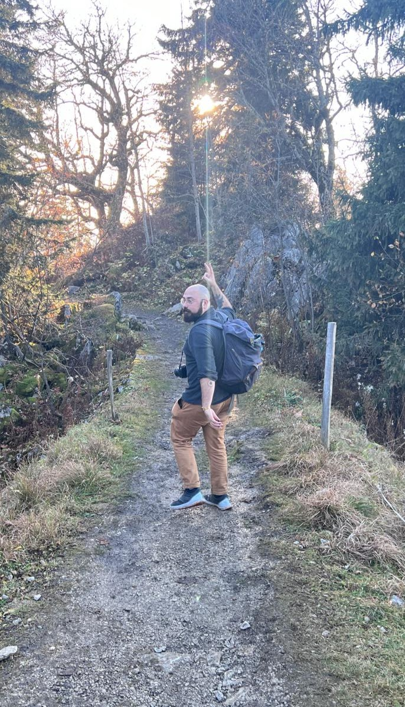

# Dr. Matthew Hart

| [CV](cv/CV_June2025.pdf) | [LinkedIn](https://www.linkedin.com/in/hart-et-al/) | [Google Scholar](https://scholar.google.com/citations?user=UP0l5jIAAAAJ&hl=en) | [Blog](blog/Landing.md) | [Projects](projects/Landing.md) | [Github](https://github.com/matthart97) | [Consulting](consulting/Landing.md) | [Contact](contact.md) |

# About Me 

I'm Matt, and I work at the intersection of artificial intelligence and chemistry!

I'm passionate about solving the worlds sceintific problems. 

If you want to read my thoughts on a few various subjects, see my blog. 

I also like to make things, check out my projects. 

